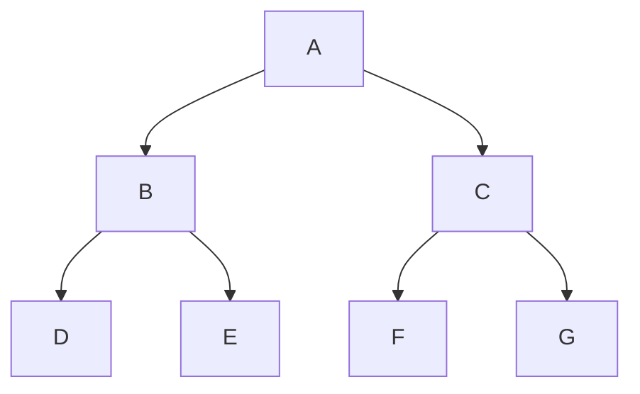
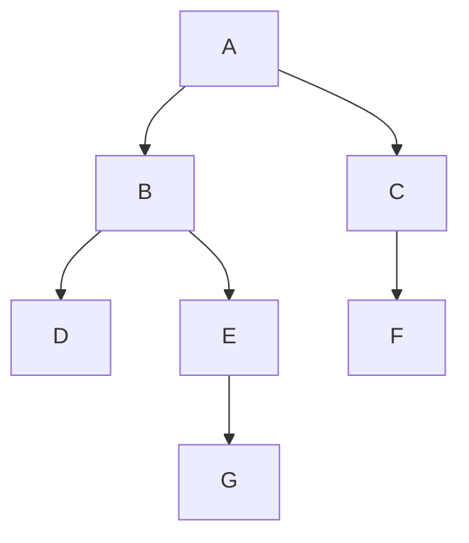
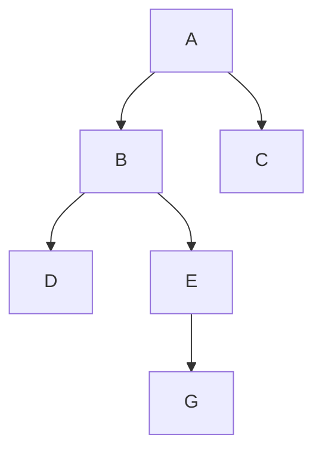
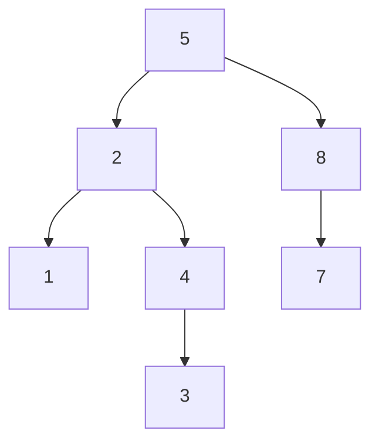
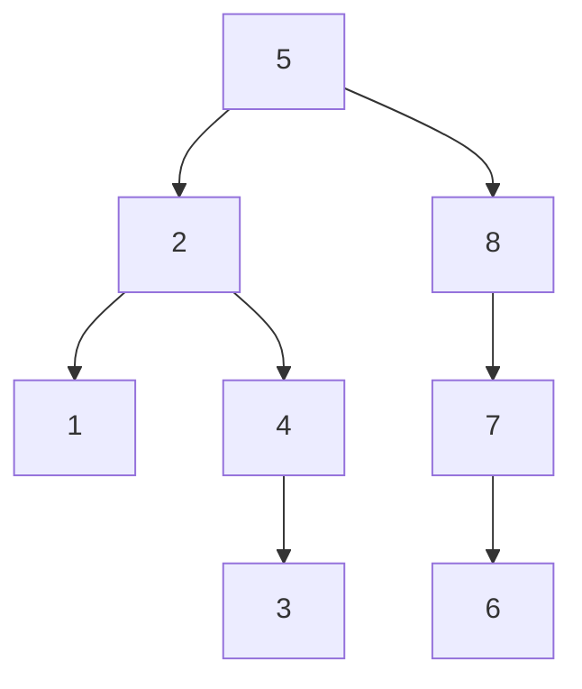

# AVL Trees
* AVL Trees are self-balancing binary trees
* The worst case of an unbalanced tree is O(n), which we want to avoid (literally the same as a linear search)
* The height of a balanced binary tree is O(log(n))

## Balanced Binary Tree Characteristic
* For each node, the height of the left and right subtrees can differ at most 1. This is an AVL Tree

* This tree violates the AVL idea, the root being the problem

## Origin
* This idea was developed by Adelson-Velskii and Landis in 1962
## Insertion
This is the original AVL tree

I want to insert 6, but it violates the AVL property

**NEEDS TO BE CONTINUED**

